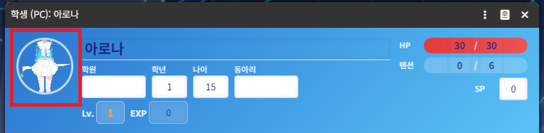
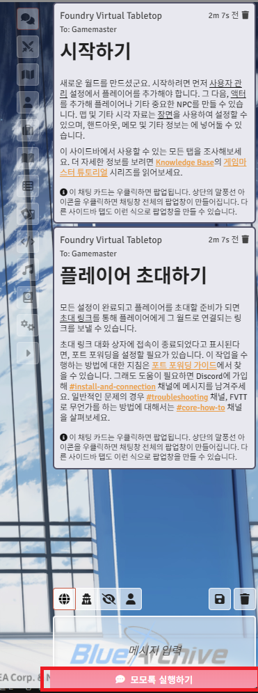
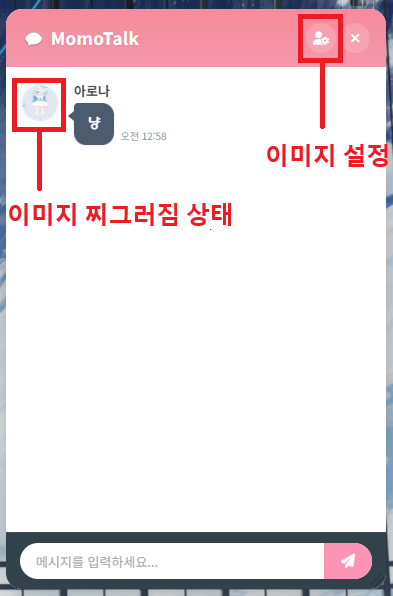
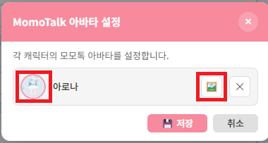
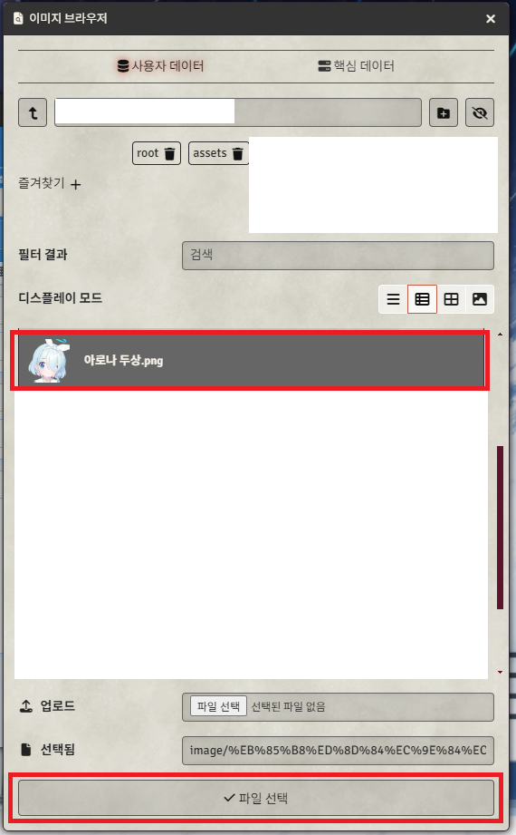
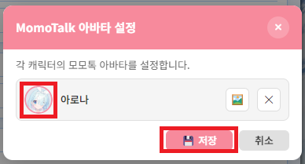
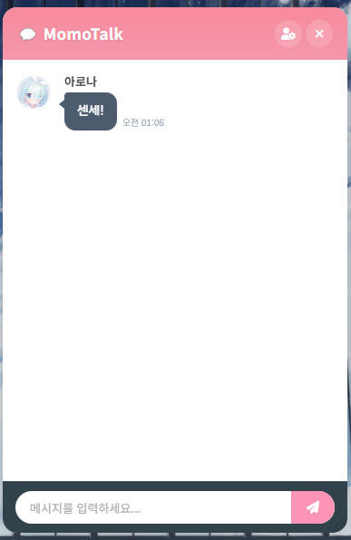

# fvtt-aa-momotalk
모모톡 fvtt 모듈

AI를 사용하여 fvtt 13v로 구현한 모모톡 모듈입니다.

간단하게 사용합니다.

# 사용법
## 1. 캐릭터 이미지

캐릭터의 이미지는 시트의 기본 이미지 파일로 먼저 맵핑됩니다.

## 2. 모모톡 접속

모모톡은 사이드바 최하단에 존재합니다.
이곳을 클릭하시면 모모톡 팝업이 켜집니다.

## 3. 모모톡 이미지 수정

맵핑된 정사각형 이미지가 아닌 경우 이미지가 찌그러집니다.
캐릭터 이미지는 맵핑을 따로할 수 있습니다.
상단의 설정 버튼을 누릅니다.

## 4. 모모톡 이미지 설정

그러면 새로운 창이 나옵니다.
모든 캐릭터가 이곳에 존재합니다.
변경할 캐릭터의 오른쪽에 있는 사진 아이콘을 클릭합니다.

## 5. 이미지 선택

파일 선택기가 나옵니다.
미리 편집해둔 1x1의 정사각형 이미지를 선택하고 파일 선택을 클릭합니다.

## 6. 이미지 설정 저장

이미지가 설정한 것을 확인하고 저장을 눌러줍니다.
저장을 누르지 않으면 설정은 사라집니다. 설정했다면 눌러줍시다.

## 7. 모모톡 이미지 확인

모모톡 팝업은 실시간 패치가 되지 않습니다.
모모톡을 닫았다 다시 누르면 깨끗한 정사각형 이미지로 변해있을 것입니다.

## 8. 참고사항
해당 모듈은 13버전을 바탕으로 했으며 추가 개발 예정이 없습니다.
만약 더 높은 버전을 사용하시려면 module.json에서 verified 버전을 변경하여 사용하실 수 있으십니다.

모모톡의 닉네임은 따로 설정할 수 없습니다. 닉네임은 일반채팅에서 이름에 따릅니다.

일반채팅하고 바로 연동되지 않습니다. 모모톡 모듈은 일반채팅에 있는 내용을 가져와 로딩합니다.
일반채팅의 내용을 삭제나 수정 시 모모톡을 닫으면 다시금 생성되어 반영됩니다.

감사합니다.

## 9. License
본 저작물은 경기도에서 제작한 경기천년체를 사용하였습니다.
또한 이를 위하여 다음과 같은 프로젝트가 사용되었습니다.

https://github.com/Nyannnnng/GyeonggiTitleWoff

본 저작물은 비공식적인 비영리 목적의 디지털 콘텐츠이며, 주식회사 넥슨코리아의 게임 블루 아카이브의 2차 창작 저작물입니다.

© NEXON Korea Corporation All Rights Reserved.

일본 등의 국가, 지역에서는 주식회사 넥슨코리아와 주식회사 요스타가 공동 소유하여 다음과 같은 저작권 표기를 추가합니다.

© NEXON Games Co., Ltd. & NEXON Korea Corp. & Yostar, Inc. All Rights Reserved.
